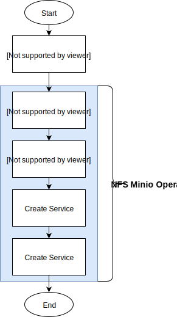

# NFS Minio Operator
A Kubernetes operator to access your NFS data using Minio's S3 compatible API.


[Docker hub](https://hub.docker.com/r/greenstatic/nfs-minio-operator)



By defining a simple NFSMinio YAML file (see bellow) we create the necessary deployment, service, ingress and NFS connectivity for you.

**Sample NFSMinio YAML Configuration File**
```yaml
apiVersion: k8.krmelj.xyz/v1alpha1
kind: NFSMinio
metadata:
  name: nfsminio-foo
spec:
  # username needs to be at least 3 characters long! (because we set it as the access key of Minio)
  username: public
  nfs:
    server: example.com
    path: /home/foo
    readOnly: false
  domain: foo.example.net
```

On `http://foo.example.net` you will be able to access your data using Minio's web-based GUI or connect via any S3 API compliant library.

## Installation
Clone this repository onto a machine that has kubectl connectivity with your Kubernetes cluster.

Ensure you have RBAC enabled on the cluster, then run the following:

```bash
kubectl create -f deploy/crds/k8_v1alpha1_nfsminio_crd.yaml
kubectl create -f deploy/service_account.yaml
kubectl create -f deploy/role.yaml
kubectl create -f deploy/role_binding.yaml
kubectl create -f deploy/operator.yaml
```

Check to see if the `nfs-minio-operator` deployment is running (`kubectl get deployments`).

## Usage & Configuration
N different users mean n different YAML files.
Each user will get their own Minio instance (with root access) on their own domain.

You can copy the NFSMinio configuration [above](#nfs-minio-operator) or copy the one in `deploy/crds/k8_v1alpha1_nfsminio_cr.yaml`.

The **access key is the username** and the **secret key** is a **randomly generated** string.
You can access it by reading the secret (the secret is named the same as the `NFSMinio` object.

```bash
# replace nfsminio-foo with your NFSMinio name value
kubectl get secret nfsminio-foo --template={{.data.secretKey}} | base64 --decode
```

If you wish you can also change the secret key in the secret object.
This will restart the Minio server in order to apply the new secret key.
The new secret key MUST be between 8-40 characters (Minio limitation).

Changing the access key is currently not supported.

To view all NFSMinio objects run: `kubectl get nfsminios`.

## Devlopment
### Dependencies
* [Operator Framework SDK](https://github.com/operator-framework/operator-sdk) - check all dependencies
* [Golang (v12.9+)](https://golang.org)

## Setting Up Environment
1. Clone (fork) repository
2. Enable Go Module support by running
    ```bash
    export GO111MODULE=on
    ```
## How to Develop
If you change the `nfsminio_types.go` rerun
```bash
operator-sdk generate k8s
```

If you change the OpenAPI validation section of `deploy/crds/k8_v1alpha1_nfsminio_crd.yaml`, rerun
```bash
operator-sdk generate openapi
```

### Kubernetes Development Depoyment
Run this one time on your development cluster

```bash
kubectl create -f deploy/crds/k8_v1alpha1_nfsminio_crd.yaml
kubectl create -f deploy/service_account.yaml
kubectl create -f deploy/role.yaml
kubectl create -f deploy/role_binding.yaml
kubectl create -f deploy/operator.yaml

export OPERATOR_NAME="nfs-minio-operator"
```

Then for testing the controller outside the cluster (you need connectivity with your Kubernetes cluster using kubectl) run:
```bash
operator-sdk up local --namespace=default
```
